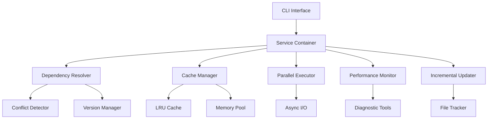

# Paker

<div align="center">


[](https://en.cppreference.com/w/cpp/17)
[](https://cmake.org/)
[](LICENSE)
[](https://github.com/your-username/paker)

**现代化 C++ 包管理器 | 高性能 | 智能缓存 | 异步I/O**

</div>

## 项目简介

**Paker** 是一个用 C++ 编写的现代化 C++ 包管理器，采用**服务导向架构**设计，支持**全局缓存模式**、**智能依赖管理**、**冲突检测与解决**、**性能监控和诊断工具**。具备精确的文件跟踪功能，确保依赖包的完整安装和清理。提供友好的彩色 CLI 输出，包括表格化显示、进度条和优化的依赖树可视化。

### 核心特性

<div align="center">

| **智能管理** | **高性能** | **开发友好** |
|:---:|:---:|:---:|
| 全局缓存模式 | 异步I/O操作 | 彩色CLI输出 |
| 智能依赖解析 | 并行下载 | 表格化显示 |
| 冲突检测解决 | 增量更新 | 进度条显示 |
| 版本回滚系统 | 内存优化 | 依赖树可视化 |

</div>

## 主要功能

### 智能包管理
- **全局缓存模式**：多项目共享包，节省空间和时间
- **智能依赖解析**：自动检测和解决版本冲突、循环依赖
- **版本回滚系统**：支持快速、安全地回滚到之前的版本
- **冲突检测解决**：强大的依赖冲突检测与解决机制

### 性能优化
- **异步I/O操作**：使用异步文件操作和网络下载，减少阻塞
- **并行下载**：同时下载多个包，安装速度提升2-5倍
- **增量更新**：只下载变更文件，减少80-90%下载时间
- **缓存预热**：启动时预加载常用包，首次使用速度提升70%+

### 智能算法
- **自适应负载均衡**：根据系统负载自动调整并发工作线程数量
- **智能缓存策略**：基于访问模式动态调整缓存策略
- **预测性预加载**：基于依赖关系预测并预加载可能需要的包
- **自适应重试机制**：根据网络状况调整重试次数和延迟时间

## 性能指标

<div align="center">

| 优化项目 | 性能提升 | 说明 |
|:---:|:---:|:---|
| **并行下载** | **2-5倍** | 同时下载多个包 |
| **增量更新** | **80-90%** | 只下载变更文件 |
| **缓存预热** | **70%+** | 首次使用速度提升 |
| **增量解析** | **60-80%** | 智能缓存解析结果 |
| **异步I/O** | **3-10倍** | 异步文件操作和网络下载 |
| **内存优化** | **50-80%** | 智能内存池、零拷贝I/O |
| **智能缓存** | **85%+** | LRU算法管理缓存命中率 |

</div>

## 快速开始

### 基本使用

```bash
# 初始化项目
Paker init

# 添加依赖包
Paker add fmt

# 列出依赖
Paker list

# 查看依赖树
Paker tree
```

### 高级功能

```bash
# 并行安装多个包
Paker add-p fmt spdlog nlohmann-json

# 缓存管理
Paker cache status
Paker cache clean --smart

# 回滚管理
Paker rollback fmt --list
Paker rollback fmt 1.0.0

# 性能监控
Paker perf
Paker analyze
```

### 开发模式

```bash
# 启用开发模式查看高级命令
Paker --dev cache-migrate
Paker --dev io --test
Paker --dev parse --validate
```

## 架构设计

Paker 采用现代化的服务导向架构（SOA）设计：



## 项目结构

```
Paker/
├── include/Paker/           # 头文件目录
│   ├── core/               # 核心功能模块
│   ├── dependency/         # 依赖管理模块
│   ├── conflict/          # 冲突检测与解决
│   ├── commands/           # CLI命令模块
│   ├── monitor/            # 监控与诊断模块
│   ├── cache/              # 缓存管理模块
│   ├── simd/               # SIMD优化模块
│   └── network/            # 网络优化模块
├── src/Paker/              # 源代码实现
│   ├── core/               # 核心功能实现
│   ├── dependency/         # 依赖管理实现
│   ├── conflict/          # 冲突检测实现
│   ├── commands/           # 命令实现
│   ├── monitor/            # 监控实现
│   ├── cache/              # 缓存实现
│   ├── simd/                # SIMD优化实现
│   └── network/             # 网络优化实现
├── test/                   # 测试文件
│   ├── unit/               # 单元测试
│   └── integration/        # 集成测试
├── examples/               # 示例代码
├── scripts/                # 构建和优化脚本
├── docs/                   # 项目文档
└── CMakeLists.txt          # 构建配置
```

## 文档导航

<div align="center">

| 文档类型 | 文档名称 | 描述 |
|:---:|:---:|:---|
| **快速开始** | [命令行使用指南](docs/COMMAND_LINE_USAGE.md) | 详细的命令行功能说明和使用示例 |
| **命令参考** | [命令参考](docs/COMMAND_REFERENCE.md) | 快速命令查询表，适合日常使用 |
| **功能特性** | [功能特性详解](docs/FEATURES.md) | 深入了解 Paker 的所有功能特性 |
| **架构优化** | [头文件优化](docs/HEADER_OPTIMIZATION.md) | 编译性能优化和头文件管理 |
| **网络优化** | [网络优化](docs/NETWORK_OPTIMIZATION.md) | HTTP/2、连接池、CDN集成 |
| **SIMD优化** | [SIMD优化](docs/SIMD_OPTIMIZATION.md) | SIMD指令集加速数据处理 |

</div>

## 技术栈

### 核心依赖

| 依赖库 | 版本 | 用途 | 状态 |
|:---:|:---:|:---:|:---:|
| [CLI11](https://github.com/CLIUtils/CLI11) | 最新 | 命令行参数解析 | ✅ 已集成 |
| [nlohmann/json](https://github.com/nlohmann/json) | 最新 | JSON处理 | ✅ 已集成 |
| [glog](https://github.com/google/glog) | 最新 | 日志记录 | ✅ 必需 |
| [CURL](https://curl.se/) | 最新 | 网络下载和HTTP客户端 | ✅ 必需 |
| [OpenSSL](https://www.openssl.org/) | 最新 | 加密和哈希计算 | ✅ 必需 |
| [zlib](https://zlib.net/) | 最新 | 数据压缩和解压缩 | ✅ 必需 |

### 系统要求

| 组件 | 要求 | 说明 |
|:---:|:---:|:---|
| **编译器** | C++17+ | 支持现代C++特性 |
| **构建系统** | CMake 3.10+ | 跨平台构建 |
| **版本控制** | Git | 依赖包管理 |
| **操作系统** | POSIX兼容 | Linux、macOS、WSL等 |

## 构建和测试

```bash
# 构建项目
mkdir build && cd build
cmake ..
make -j4

# 运行测试
./build/test/PakerUnitTests

# 运行性能测试
./scripts/performance_test.sh
```

## License
MIT